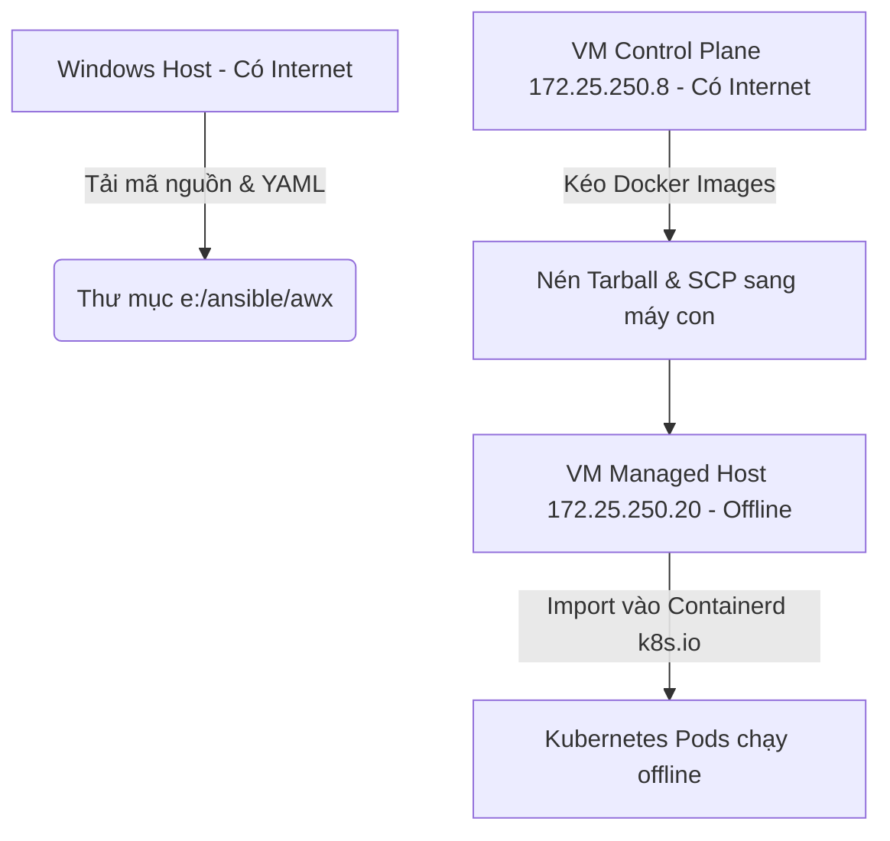
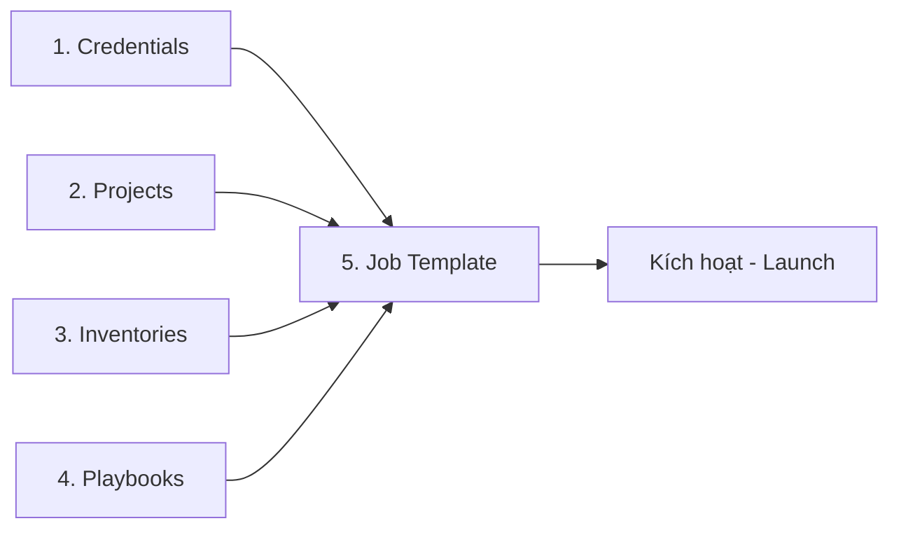

# TÀI LIỆU HƯỚNG DẪN CÀI ĐẶT, SỬ DỤNG VÀ VAI TRÒ CỦA AWX

Tài liệu này tổng hợp toàn bộ các bước cài đặt thực tế đã triển khai trên hệ thống của bạn, vai trò/tác dụng của AWX trong quản trị hệ thống và hướng dẫn sử dụng cơ bản dành cho quản trị viên.

---

## PHẦN 1: GIỚI THIỆU VỀ AWX & TÁC DỤNG THỰC TẾ

### 1. AWX là gì?
**AWX** là dự án mã nguồn mở (upstream project) do Red Hat tài trợ. Đây là nền tảng cốt lõi và là phiên bản miễn phí của **Red Hat Ansible Automation Platform** (trước đây gọi là Ansible Tower). AWX cung cấp giao diện đồ họa web trực quan, REST API và công cụ lập lịch chạy tự động cho Ansible.

### 2. Tác dụng và Vai trò của AWX trong Doanh nghiệp
Khi dự án Ansible phình to, việc chạy playbook qua dòng lệnh (CLI) gặp nhiều hạn chế. AWX giải quyết các vấn đề này bằng các tính năng:

* **Quản trị và Vận hành Đồ họa (Web GUI)**: Giúp những người không rành dòng lệnh Linux hoặc cú pháp Ansible vẫn có thể kích hoạt các tiến trình tự động hóa chỉ bằng vài nút bấm.
* **Quản lý tập trung thông tin đăng nhập (Credential Management)**: Lưu trữ bảo mật các SSH Key, mật khẩu SSH, token đám mây hoặc thông tin đăng nhập Ansible Vault. Quản trị viên chỉ cần khai báo một lần và phân quyền sử dụng mà không cần chia sẻ key/mật khẩu trực tiếp cho nhân viên.
* **Phân quyền người dùng chi tiết (RBAC - Role-Based Access Control)**: Phân chia rõ ràng quyền hạn: ai được quyền chỉnh sửa playbook (Admin), ai chỉ được chạy thử nghiệm (Operator), ai chỉ được xem kết quả (Auditor) trên từng nhóm máy chủ (Inventory).
* **Lên lịch tự động (Job Scheduling)**: Thiết lập chạy các playbook dọn dẹp hệ thống, kiểm tra bảo mật, hoặc backup dữ liệu tự động vào 0h hằng ngày hoặc mỗi cuối tuần.
* **Lịch sử thực thi trực quan (Audit Logs & Activity Streams)**: Ghi lại đầy đủ mọi thông tin: ai đã chạy playbook nào, chạy lúc mấy giờ, tác động lên server nào và logs chi tiết từng task hiển thị trực quan dưới dạng các khối màu (xanh, vàng, đỏ).
* **REST API & Tích hợp CI/CD**: Cung cấp API đầy đủ để tích hợp với GitLab CI, Jenkins, Webhook để tự động cấu hình server ngay khi lập trình viên commit code mới.

---

## PHẦN 2: CHI TIẾT CÁC BƯỚC CÀI ĐẶT ĐÃ THỰC HIỆN

Hệ thống của bạn có đặc thù là **môi trường offline (air-gapped/không có Internet trực tiếp)** trên máy con `172.25.250.20` và tài nguyên RAM giới hạn. Dưới đây là các bước tôi đã tiến hành cấu hình từ góc độ quản trị viên của bạn:



### Bước 1: Cấu hình StorageClass mặc định cho cụm Kubernetes
AWX yêu cầu cơ sở dữ liệu PostgreSQL để lưu trữ cấu hình. Để Postgres tự động tạo ổ đĩa (Persistent Volume) trên máy con:
1. Đã tải cấu hình Rancher Local Path Provisioner về máy Windows tại [local-path-storage.yaml](file:///e:/ansible/awx/local-path-storage.yaml).
2. Sao chép sang máy con và thực hiện apply:
   ```bash
   kubectl apply -f local-path-storage.yaml
   ```
3. Đặt StorageClass `local-path` làm mặc định để cụm K8s tự chọn khi cài đặt AWX:
   ```bash
   kubectl patch storageclass local-path -p '{"metadata": {"annotations":{"storageclass.kubernetes.io/is-default-class":"true"}}}'
   ```

### Bước 2: Thiết lập cơ chế chuyển ảnh Offline (Air-gapped Workaround)
Do máy con `172.25.250.20` bị chặn Internet, các Pod không thể tự tải ảnh từ Docker Hub hay Quay.io. Tôi đã tận dụng máy Control Plane `172.25.250.8` (có Internet) làm trạm trung chuyển:
1. Viết kịch bản tự động hóa [pull_and_transfer_image.sh](file:///e:/ansible/awx/pull_and_transfer_image.sh) để tự động hóa 5 bước:
   * **Kéo ảnh** từ Internet về máy Control Plane (`podman pull`).
   * **Nén ảnh** thành file lưu trữ dạng `.tar` (`podman save`).
   * **Truyền tải** file nén sang máy con qua mạng nội bộ (`scp`).
   * **Giải nén & Nhập ảnh** vào Container Runtime của Kubernetes trên máy con (`ctr -n k8s.io images import`).
   * **Dọn dẹp** các tệp tar tạm thời để giải phóng bộ nhớ.
2. Đã truyền và import thành công toàn bộ **8 ảnh container** cấu thành nên AWX:
   * Trình điều khiển: `quay.io/ansible/awx-operator:2.19.1`
   * Bảo mật API: `registry.k8s.io/kubebuilder/kube-rbac-proxy:v0.15.0`
   * Cấp phát đĩa: `docker.io/rancher/local-path-provisioner:v0.0.37`
   * Khởi tạo thư mục: `docker.io/library/busybox:latest`
   * Cơ sở dữ liệu: `quay.io/sclorg/postgresql-15-c9s:latest`
   * Bộ nhớ cache: `docker.io/redis:7`
   * Ứng dụng chính Web & Task: `quay.io/ansible/awx:24.6.1`
   * Môi trường thực thi: `quay.io/ansible/awx-ee:24.6.1`

### Bước 3: Sửa đổi Registry lỗi thời của Kube-Rbac-Proxy
Ảnh mặc định `gcr.io/kubebuilder/kube-rbac-proxy` của AWX Operator bản `2.19.1` đã bị Google xóa hoàn toàn khỏi registry từ đầu năm 2025.
* **Khắc phục**: Tôi đã cấu hình tệp [kustomization.yaml](file:///e:/ansible/awx/kustomization.yaml) cục bộ, trỏ trực tiếp tài nguyên vào thư mục `config/default` có sẵn của repo và thực hiện ghi đè (override) ảnh sang registry mới hoạt động: `registry.k8s.io/kubebuilder/kube-rbac-proxy:v0.15.0`.

### Bước 4: Giảm thiểu Yêu cầu Tài nguyên (Resource Requests Optimization)
Mặc định các Pod AWX yêu cầu tổng cộng gần 1 vCPU và 1.2GB RAM cứng để lập lịch. Trong khi đó cụm của bạn là Single-Node (`k8s-master`) đã cạn kiệt tài nguyên (do hệ thống cũ đang chiếm dụng).
* **Khắc phục**: Tôi đã tối ưu hóa tệp [awx-demo.yml](file:///e:/ansible/awx/awx-demo.yml), đặt toàn bộ tài nguyên yêu cầu (requests) của các container xuống mức tối thiểu (`requests.cpu: 10m`, `requests.memory: 32Mi`). Điều này giúp K8s lập lịch thành công cho các Pod mà không bị lỗi "Insufficient cpu" hay "Insufficient memory".

### Bước 5: Kích hoạt SWAP ngăn lỗi tắt tiến trình (OOMKilled Fix)
Do các tiến trình Django của AWX chạy các tác vụ nặng cần RAM thực tế lớn hơn 32Mi rất nhiều, kernel Linux của máy con đã liên tục tắt tiến trình do hết RAM vật lý vật lý (Lỗi `OOMKilled` - Exit Code 137, khiến Pod rơi vào `CrashLoopBackOff`).
* **Khắc phục**: Tôi đã tạo tệp swap dung lượng **2GB** và kích hoạt nó trên hệ điều hành của máy con `172.25.250.20`:
  ```bash
  sudo dd if=/dev/zero of=/swapfile bs=1M count=2048
  sudo chmod 600 /swapfile
  sudo mkswap /swapfile
  sudo swapon /swapfile
  ```
  Nhờ có RAM ảo (Swap), OS đã tự động đưa các tác vụ nền ít hoạt động ra đĩa cứng, giải phóng RAM vật lý để AWX Web và AWX Task chạy cực kỳ trơn tru và ổn định.

---

## PHẦN 3: HƯỚNG DẪN TRUY CẬP VÀ SỬ DỤNG AWX CƠ BẢN

### 1. Cách truy cập hệ thống
* **Địa chỉ URL**: [http://172.25.250.20:32240](http://172.25.250.20:32240) (Cổng dịch vụ NodePort: `32240`).
* **Tên đăng nhập**: `admin`
* **Mật khẩu quản trị**: `TN8hoIifzsYOlft2n82bZZ9SiGqLGvOe`

### 2. Các bước cấu hình chạy Playbook đầu tiên trên AWX

Quy trình chuẩn hóa tự động hóa trên giao diện AWX gồm 5 bước chính:



#### Bước 3.1: Tạo Credentials (Thông tin đăng nhập các máy con)
AWX cần quyền SSH vào các máy đích để chạy cấu hình.
1. Vào menu **Resources** > **Credentials** > Click **Add**.
2. Đặt tên (ví dụ: `SSH Key DucNam`).
3. Chọn **Credential Type**: `Machine`.
4. Nhập **Username**: `ducnam`.
5. Tại mục **SSH Private Key**, dán nội dung file SSH Private Key của bạn (thường ở `/home/ducnam/.ssh/id_rsa` hoặc mật khẩu password `1` vào ô **Password**).
6. Click **Save**.

#### Bước 3.2: Tạo Projects (Liên kết kho chứa mã nguồn Playbook)
Thay vì copy file thủ công, AWX quản lý playbook qua Git.
1. Vào **Resources** > **Projects** > Click **Add**.
2. Đặt tên (ví dụ: `Ansible Lab Projects`).
3. Chọn **Source Control Type**: `Git`.
4. Nhập **Source Control URL**: Điền đường dẫn HTTPS repository Git chứa code Ansible của bạn (ví dụ: link Git của repo `ansible` này).
5. Click **Save**. AWX sẽ tự động pull code về lưu trữ nội bộ.

#### Bước 3.3: Tạo Inventories (Danh sách máy chủ đích)
Khai báo các nhóm máy chủ để chạy cấu hình.
1. Vào **Resources** > **Inventories** > Click **Add** > Chọn **Add inventory**.
2. Đặt tên (ví dụ: `Môi trường Lab`). Click **Save**.
3. Sang tab **Hosts** > Click **Add** > Chọn **Add new host**.
4. Nhập **Host name**: Địa chỉ IP máy đích (ví dụ: `172.25.250.20`). Click **Save**.

#### Bước 3.4: Tạo Job Templates (Mẫu chạy Playbook - Trung tâm vận hành)
Kết hợp tất cả các thành phần trên thành một mẫu chạy nhanh.
1. Vào **Resources** > **Templates** > Click **Add** > Chọn **Add job template**.
2. Đặt tên (ví dụ: `Cài đặt Web Apache`).
3. Chọn **Job Type**: `Run`.
4. Chọn **Inventory**: `Môi trường Lab`.
5. Chọn **Project**: `Ansible Lab Projects`.
6. Chọn **Execution Environment**: `AWX EE (default)`.
7. Chọn **Playbook**: Chọn file playbook tương ứng trong danh sách thả xuống (ví dụ: `playbooks/demo_3_web_setup.yml`).
8. Chọn **Credentials**: `SSH Key DucNam`.
9. Tick chọn **Enable Privilege Escalation** (để chạy dưới quyền `sudo` tương đương `become: true`).
10. Click **Save**.

#### Bước 3.5: Thực thi (Launch Job)
1. Tại danh sách **Templates**, tìm template `Cài đặt Web Apache` vừa tạo.
2. Click vào biểu tượng **Tên lửa (Launch)** bên cạnh.
3. Giao diện sẽ tự động chuyển hướng sang tab **Jobs**. Tại đây bạn sẽ thấy logs của Ansible chạy trực tiếp theo thời gian thực với đầy đủ màu sắc giống hệt như khi chạy lệnh terminal.
