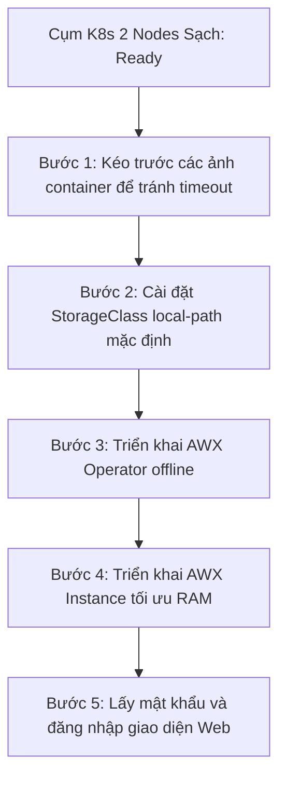

# HƯỚNG DẪN CÀI ĐẶT AWX TRÊN CỤM K8S 2 NODES SẠCH

Tài liệu này hướng dẫn chi tiết từng bước cài đặt AWX trên cụm Kubernetes 2 Nodes (`k8s-master` - `172.25.250.20` và `k8s-worker` - `172.25.250.30`) sạch vừa được thiết lập, sử dụng phân vùng lưu trữ tốc độ cao `/data` NVMe và chạy Calico CNI.

---

## Sơ đồ Quy trình Triển khai



---

## Thư mục Tài nguyên trên Master Node

Toàn bộ các tệp tin cấu hình đã được sao chép sẵn vào Master Node tại đường dẫn:
📁 **`/home/ducnam/awx_reinstall/`**

Vui lòng đăng nhập SSH vào máy Master bằng tài khoản `ducnam` để thực hiện các bước tiếp theo:
```bash
ssh ducnam@172.25.250.20
# Mật khẩu: 1
cd /home/ducnam/awx_reinstall/
```

---

## Hướng dẫn cài đặt từng bước

### Bước 1: Chờ hoàn thành kéo trước (Pre-pull) toàn bộ ảnh container
Tôi đang tự động cho chạy ngầm kịch bản `pre_pull_images.sh` để kéo sẵn toàn bộ 8 ảnh container cấu thành nên AWX về local của cả Master và Worker.
* **Tác dụng**: Giúp các pod khởi chạy ngay lập tức khi apply cấu hình, tránh hoàn toàn lỗi kẹt `ImagePullBackOff` hoặc lỗi `Timeout` do tải ảnh chậm từ Internet.
* **Cách kiểm tra trạng thái kéo ảnh** (chạy trên Master):
  ```bash
  sudo crictl images
  ```
  *(Khi thấy danh sách có đủ các ảnh `awx`, `awx-operator`, `postgres`, `redis`, `local-path-provisioner`... là có thể tiến hành bước tiếp theo).*

---

### Bước 2: Cài đặt StorageClass mặc định cho cụm K8s
AWX yêu cầu một StorageClass mặc định để tự động cấp phát ổ cứng (PVC) cho cơ sở dữ liệu Postgres.
1. Triển khai Rancher Local Path Storage:
   ```bash
   kubectl apply -f local-path-storage.yaml
   ```
2. Đặt `local-path` làm StorageClass mặc định của hệ thống:
   ```bash
   kubectl patch storageclass local-path -p '{"metadata": {"annotations":{"storageclass.kubernetes.io/is-default-class":"true"}}}'
   ```
3. Kiểm tra trạng thái StorageClass:
   ```bash
   kubectl get sc
   ```
   *(Xác nhận class `local-path` hiển thị và có nhãn `(default)` bên cạnh).*

---

### Bước 3: Triển khai AWX Operator (Trình điều phối)
AWX Operator chịu trách nhiệm quản lý vòng đời và tự động hóa việc triển khai các Pod AWX.
1. Tạo namespace `awx` cho dự án:
   ```bash
   kubectl create namespace awx
   ```
2. Áp dụng cấu hình Kustomize cục bộ để triển khai Operator:
   ```bash
   kubectl apply -k .
   ```
3. Theo dõi trạng thái khởi động của Pod Operator:
   ```bash
   kubectl get pods -n awx -w
   ```
   *(Đợi cho đến khi pod `awx-operator-controller-manager-...` chuyển sang trạng thái `Running` và cột `READY` hiển thị `2/2`).*

---

### Bước 4: Triển khai AWX Instance (Ứng dụng AWX Web/Task)
Sau khi Operator hoạt động ổn định, tiến hành triển khai các pod dịch vụ chính của AWX.
1. Áp dụng tệp cấu hình đã được tối ưu hóa tài nguyên RAM/CPU cho cụm lab:
   ```bash
   kubectl apply -f awx-demo.yml
   ```
2. Theo dõi tiến trình tạo các pod dịch vụ:
   ```bash
   kubectl get pods -n awx -w
   ```
   *Quá trình này sẽ lần lượt sinh ra các pod:*
   * `awx-demo-postgres-15-0`: Cơ sở dữ liệu Postgres (Sử dụng PV tạo động từ SC local-path).
   * `awx-demo-redis-...`: Hàng đợi cache.
   * `awx-demo-migration-...`: Pod chạy migration dữ liệu (sẽ tự động biến mất khi hoàn thành).
   * `awx-demo-web-...` & `awx-demo-task-...`: Giao diện chính và công cụ chạy task.

3. Theo dõi log di chuyển dữ liệu (Migration) để biết khi nào hoàn thành:
   ```bash
   kubectl logs -f job/awx-demo-migration-24.6.1 -n awx
   ```
   *(Khi log kết thúc bằng thông báo thành công và pod chuyển sang trạng thái Completed).*

---

### Bước 5: Lấy mật khẩu và đăng nhập giao diện Web

1. **Địa chỉ truy cập**:
   Mở trình duyệt trên máy Windows và truy cập theo IP của node bất kỳ (khuyên dùng Master):
   👉 **URL**: http://172.25.250.20:32240 (Đã cố định NodePort `32240`).

2. **Tài khoản đăng nhập**:
   * Username: `admin`
   * Mật khẩu đăng nhập (trích xuất tự động từ K8s Secret):
     ```bash
     kubectl get secret awx-demo-admin-password -n awx -o jsonpath="{.data.password}" | base64 --decode ; echo
     ```
     *(Dán lệnh này vào terminal Master để nhận chuỗi mật khẩu giải mã).*
